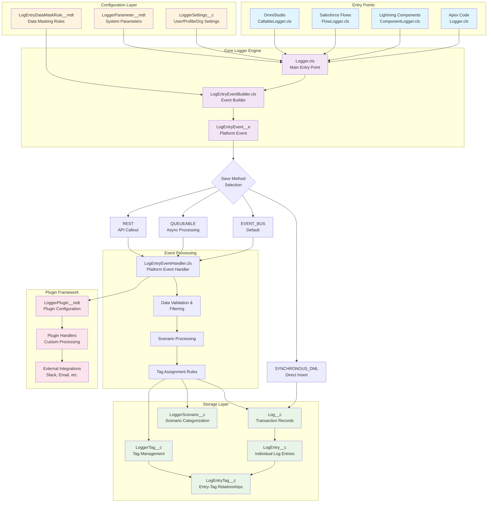

# NebulaLogger Architecture Flow

This document provides a high-level architectural overview of the NebulaLogger application using a Mermaid flow diagram. The diagram illustrates the main components, their relationships, and the data flow from logging requests to persistent storage.

## Architecture Overview

NebulaLogger is built as an event-driven, multi-technology logging framework for Salesforce. It supports logging from various Salesforce technologies through dedicated entry points, processes log data through platform events, and provides flexible storage and configuration options.

## Component Architecture & Data Flow

## Component Descriptions

### Entry Points
- **Logger.cls**: Primary Apex interface providing methods like `debug()`, `info()`, `warn()`, `error()`
- **ComponentLogger.cls**: Handles logging from Lightning Web Components and Aura components
- **FlowLogger.cls**: Provides Flow actions for logging within Salesforce Flows
- **CallableLogger.cls**: Implements `System.Callable` for OmniStudio and external system integration

### Core Logger Engine
- **Logger.cls**: Central orchestrator managing log entries, scenarios, and save operations
- **LogEntryEventBuilder.cls**: Builder pattern class that constructs `LogEntryEvent__e` records with all necessary metadata
- **LogEntryEvent__e**: Platform event that carries log data through the system before persistence

### Configuration Layer
- **LoggerSettings__c**: Hierarchical custom settings controlling logging behavior per user, profile, or organization
- **LoggerParameter__mdt**: Custom metadata for system-wide feature flags and parameters
- **LogEntryDataMaskRule__mdt**: Rules for automatically masking sensitive data in logs

### Save Methods
The system supports multiple persistence strategies:
- **EVENT_BUS**: Default method using platform events for asynchronous processing
- **QUEUEABLE**: Defers processing using queueable jobs to manage limits
- **REST**: Uses REST API callouts to avoid mixed DML operations
- **SYNCHRONOUS_DML**: Direct database operations bypassing platform events

### Event Processing
- **LogEntryEventHandler.cls**: Processes `LogEntryEvent__e` platform events and creates persistent records
- **Data Validation & Filtering**: Applies user settings and logging level filters
- **Scenario Processing**: Handles scenario-based logging and categorization
- **Tag Assignment Rules**: Automatically assigns tags based on configurable rules

### Storage Layer
- **Log__c**: Represents a logging session/transaction with metadata about the execution context
- **LogEntry__c**: Individual log messages with details like level, message, stack trace, and related records
- **LoggerScenario__c**: Categorizes related logs for better organization and analysis
- **LoggerTag__c**: Manages available tags for labeling log entries
- **LogEntryTag__c**: Junction object linking log entries to their assigned tags

### Plugin Framework
- **LoggerPlugin__mdt**: Configuration for extending the system with custom functionality
- **Plugin Handlers**: Custom Apex classes that process logs for specific integrations
- **External Integrations**: Built-in plugins for Slack notifications, email alerts, and other systems

## Data Flow Process

1. **Log Request**: A logging request is initiated from any entry point (Apex, LWC, Flow, OmniStudio)
2. **Event Building**: The core engine uses `LogEntryEventBuilder` to construct a `LogEntryEvent__e` with all necessary metadata
3. **Configuration Application**: User settings and system parameters are applied to determine logging behavior
4. **Save Method Selection**: Based on configuration and context, an appropriate save method is chosen
5. **Event Processing**: `LogEntryEventHandler` processes the platform event, applying filters and rules
6. **Data Persistence**: Log data is stored in the appropriate custom objects with proper relationships
7. **Plugin Execution**: Any configured plugins process the log data for additional functionality

This architecture provides a robust, scalable, and extensible logging solution that can handle complex Salesforce environments while maintaining performance and flexibility.
